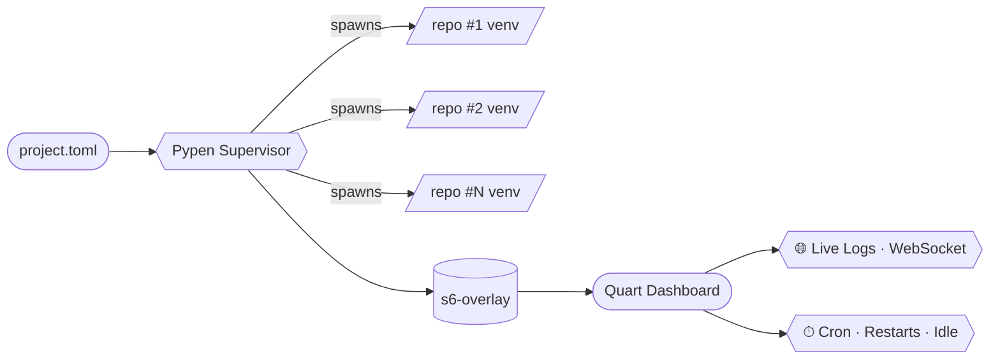

<!--
  ██████╗ ██╗   ██╗██████╗ ███████╗███╗   ██╗
  ██╔══██╗╚██╗ ██╔╝██╔══██╗██╔════╝████╗  ██║
  ██████╔╝ ╚████╔╝ ██████╔╝█████╗  ██╔██╗ ██║
  ██╔═══╝   ╚██╔╝  ██╔═══╝ ██╔══╝  ██║╚██╗██║
  ██║        ██║   ██║     ███████╗██║ ╚████║
  ╚═╝        ╚═╝   ╚═╝     ╚══════╝╚═╝  ╚═══╝
-->

 

  
  
  
  
  
  

  <kbd>⚡ async</kbd> &nbsp;•&nbsp;
  <kbd>🧬 per-bot venvs</kbd> &nbsp;•&nbsp;
  <kbd>🛰 live logs</kbd> &nbsp;•&nbsp;
  <kbd>⏱ cron</kbd> &nbsp;•&nbsp;
  <kbd>🩹 self-heal</kbd>

 

## ✨ What is Pypen?

> **Pypen** is a single-container **multi-process runner for Python repositories**.
> Point it at any GitHub repo (or many of them) in one `project.toml`, and Pypen
> clones, builds, runs, watches and restarts each one in its own isolated
> Python environment — with a live web dashboard on top.
>
> If it runs with `python something.py` (or any shell command), Pypen can host it.

<table>
<tr>
<td width="50%" valign="top">

### 🧠 Use it for

- 🐍 Hosting **any Python project** — web apps, scrapers, workers, daemons
- 🤖 Running **bots** (Telegram / Discord / Matrix / …) alongside everything else
- 🧪 Spinning up **many forks of the same repo** with different env vars
- 🛠 Replacing a fleet of tiny VPSes with **one box, many workers**
- 🌙 **Idle / scheduled restarts** to keep long-running scripts fresh

</td>
<td width="50%" valign="top">

### 🧰 Tech stack

| Layer | Tools |
|---|---|
| **Runtime** | Python 3.11+, `pyenv`, `uv` |
| **Web / API** | Quart · Uvicorn · python-socket.io |
| **Process supervision** | s6-overlay · custom `s6_svc` wrapper |
| **Scheduling** | `schedule` · async cron loop |
| **Filesystem / VCS** | GitPython · watchdog · aiofiles |
| **Observability** | Loguru · psutil · live log streaming |

</td>
</tr>
</table>

 

### 🎛 How it fits together

 

